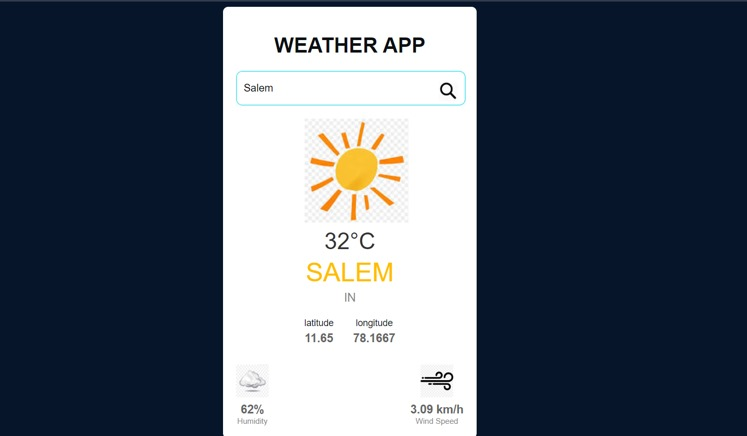
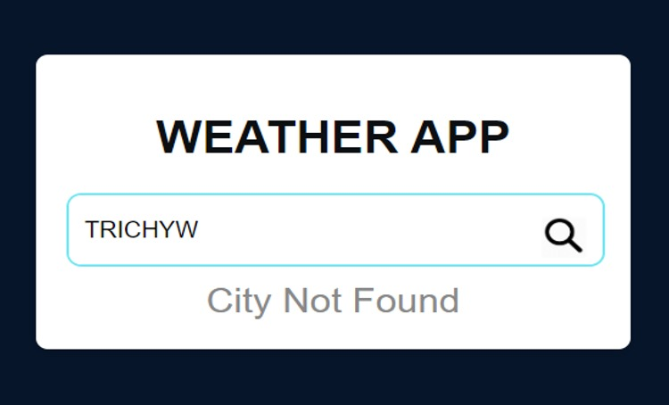
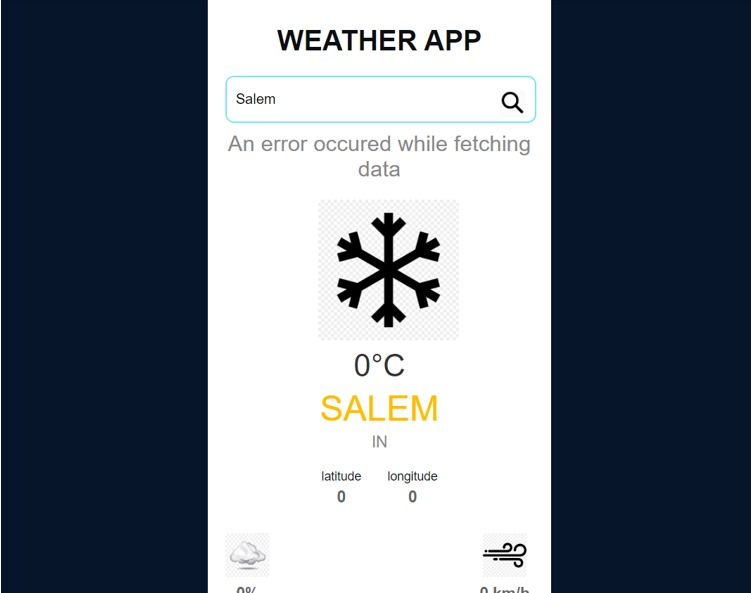

# React Weather App 🌦️

A simple and responsive weather app built using *React* and *Vite*. It fetches real-time weather data using an API and displays the current weather conditions for any searched city.

## Features ✨
- Displays the current temperature, weather conditions, humidity, and wind speed.
- Allows users to search for any city in the world.
- Dynamically updates the weather based on the search input.
- Responsive design that works on mobile, tablet, and desktop.


## Screenshots 📸
### Home Page:



### Search Results With Error Handling:



## Tech Stack 🛠️
- *React*: Front-end library for building user interfaces.
- *Vite*: Fast build tool and development server.
- *JavaScript*: Core programming language.
- *CSS*: For styling the app.
- *OpenWeatherMap API*: API to fetch real-time weather data.

## Getting Started 🏁

### Prerequisites
Make sure you have *Node.js* and *npm* installed on your machine. You can download Node.js from [here](https://nodejs.org/).

### Installation

1. Clone the repository:
   ```bash
   git clone https://github.com/your-username/react-weather-app.git
